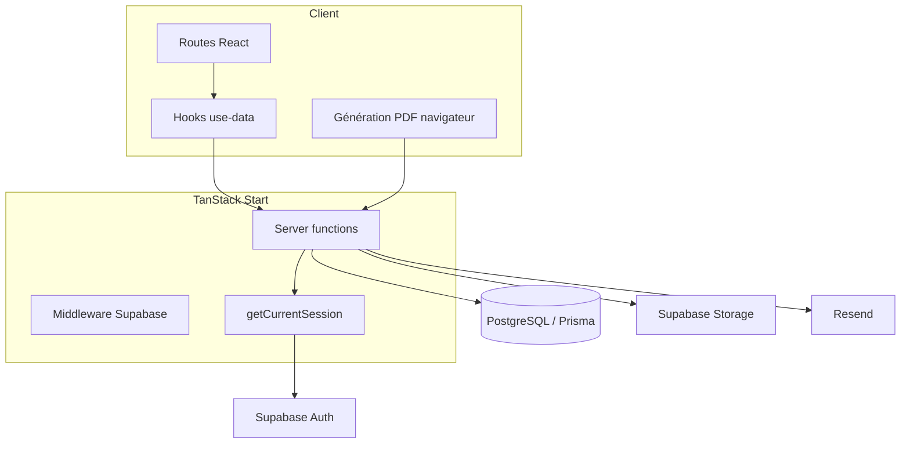

# Architecture et fonctionnement backend — 2R Hub

Document technique décrivant le fonctionnement de l’application **2R Hub** (`2ref-auto`), avec un focus sur le backend.

---

## 1. Vue d’ensemble

2R Hub est une plateforme métier pour les cabinets **2R Conseil** et **2R Expertise Fiscale**. Elle permet de gérer :

- les collaborateurs et leurs rôles ;
- les clients ;
- le catalogue de services ;
- les devis, factures et lettres ;
- l’envoi d’e-mails (documents + publipostage) ;
- les mails entrants / sortants ;
- les notifications internes.

### Stack principale

| Couche | Technologie | Rôle |
|--------|-------------|------|
| Application full-stack | **TanStack Start** + **TanStack Router** | SSR, routes fichier, *server functions* |
| UI | React 19, Tailwind CSS 4, Radix UI | Interface |
| Données côté client | TanStack Query, Zustand, Zod | Cache, état, validation |
| Build | Vite 8 (+ Nitro en build) | Développement et production |
| Base de données | **PostgreSQL** (hébergé Supabase) | Données métier |
| ORM | **Prisma 6** | Accès typé à Postgres |
| Authentification | **Supabase Auth** | Sessions, mots de passe, invitations |
| E-mails | **Resend** | Envoi et synchronisation inbound |
| Fichiers | **Supabase Storage** | Fiches clients, PDF documents |
| PDF | html2canvas + jsPDF (navigateur) | Génération PDF depuis l’aperçu HTML |

> **Note :** le paquet `better-auth` peut être présent dans le dépôt (branche d’exploration), mais **l’authentification en production repose sur Supabase Auth**.

---

## 2. Architecture globale

```
┌─────────────────────────────────────────────────────────────┐
│  Navigateur (React)                                         │
│  Routes · Hooks use-data · Aperçus documents · PDF client   │
└───────────────────────────┬─────────────────────────────────┘
                            │ appels createServerFn / Auth
┌───────────────────────────▼─────────────────────────────────┐
│  TanStack Start (serveur)                                   │
│  Middleware Supabase · Server functions · Session app       │
└──────┬──────────────┬──────────────┬──────────────┬─────────┘
       │              │              │              │
       ▼              ▼              ▼              ▼
  PostgreSQL     Supabase Auth   Supabase      Resend
  (Prisma)       (sessions)      Storage       (e-mails)
```

Le frontend n’accède **jamais** directement à Prisma. Tout le métier passe par des **server functions** (`createServerFn`), exécutées côté serveur.

---

## 3. Pattern backend : les server functions

Les modules backend métier se trouvent principalement dans `src/lib/*.functions.ts` (et quelques fichiers dédiés comme `mail-merge.ts`, `send-document-email.ts`).

### Principe

```ts
export const listClients = createServerFn({ method: "GET" })
  .handler(async () => {
    const session = await requireSession(); // ou getCurrentSession()
    // … Prisma …
    return rows.map(mapClient);
  });

export const createClient = createServerFn({ method: "POST" })
  .validator(clientInputSchema) // Zod
  .handler(async ({ data }) => {
    // …
  });
```

Côté UI / hooks :

```ts
await listClients();
await createClient({ data: { name: "…", /* … */ } });
```

### Fichiers backend majeurs

| Fichier | Responsabilité |
|---------|----------------|
| `src/lib/data.functions.ts` | Clients, services, documents, company, notifications, archives, traces PDF, abonnements factures |
| `src/lib/session.functions.ts` | Session applicative (`user` + `staff` + `activeCabinet`) |
| `src/lib/admin.functions.ts` | Bootstrap auth, onboarding, équipe, invitations, rôles, profil |
| `src/lib/mail.functions.ts` | Boîte mails (list / sync inbound Resend) |
| `src/lib/mail-merge.ts` | Campagnes de publipostage (créer → signer → marquer envoyé) |
| `src/lib/send-document-email.ts` | Envoi d’un document par e-mail (HTML + PDF optionnel) |
| `src/lib/staff.functions.ts` / `staff-sync.ts` | Synchronisation du profil Auth → table `staff_members` |
| `src/lib/middleware.ts` | Middleware session Supabase (cookies SSR) |
| `src/start.ts` | Branchement middleware global |

### Sécurité typique d’un handler

1. Vérifier la session (`requireSession` / `getCurrentSession`).
2. Appliquer les droits (`roles.ts` : admin, créateur, cabinet actif…).
3. Filtrer Prisma par `activeCabinet` (sauf super admin avec scope `"all"`).
4. Valider l’entrée avec Zod.
5. Retourner des objets mappés (`mappers.ts`) pour le frontend (pas les types Prisma bruts).

---

## 4. Authentification et session

### 4.1 Connexion

1. L’utilisateur saisit e-mail / mot de passe sur `/login`.
2. `src/lib/auth.ts` appelle `supabase.auth.signInWithPassword`.
3. Supabase pose des cookies de session (via `@supabase/ssr`).
4. Le layout `_app` appelle `getAuthBootstrap` pour décider de la suite :
   - `ready` → accès app ;
   - `needs_password` → `/auth/set-password` ;
   - `needs_onboarding` → `/onboarding` ;
   - `access_denied` → refus (compte non provisionné / invite-only).

Par défaut, l’inscription publique est **désactivée** : seuls les super admins créent les comptes depuis la page Équipe.

### 4.2 Session applicative (`getCurrentSession`)

Fichier : `src/lib/session.functions.ts`.

Pour chaque requête authentifiée, le serveur :

1. Lit la session Supabase (`getSession` / éventuellement `getUser`).
2. Synchronise / récupère le `StaffMember` Prisma (id = id Auth).
3. Peut promouvoir automatiquement en `super_admin` si l’e-mail est dans `SUPER_ADMIN_EMAIL`.
4. Résout le **cabinet actif** (cookie `2r-active-cabinet` pour le super admin ; sinon cabinet du staff).
5. Retourne `{ user, staff, activeCabinet }` (mémoïsé quelques minutes).

### 4.3 Middleware

`supabaseSessionMiddleware` (dans `src/lib/middleware.ts`) :

- crée un client Supabase SSR à partir des cookies de la requête ;
- rafraîchit la session si besoin ;
- propage les `Set-Cookie` vers la réponse.

### 4.4 Mot de passe oublié

1. `requestPasswordReset` → `resetPasswordForEmail` (redirect `/auth/callback`).
2. Flag `localStorage` pour détecter le flux recovery (ouverture du lien e-mail dans un autre onglet).
3. `/auth/callback` échange le code PKCE, attend éventuellement l’événement `PASSWORD_RECOVERY`.
4. Redirection vers `/auth/reset-password` pour saisir le nouveau mot de passe.

### 4.5 Création d’utilisateurs (super admin)

Via `admin.functions.ts` et l’**Admin API** Supabase :

- `createStaffWithPassword` : crée le user Auth + ligne `staff_members` (mot de passe temporaire) ;
- `inviteStaffMember` : invitation e-mail (option historique) ;
- `deleteStaffMember` : suppression staff + user Auth.

---

## 5. Modèle de données (Prisma)

Fichier : `prisma/schema.prisma`.

### Enums importants

- `Cabinet` : `conseil` | `expertise_fiscale`
- `StaffRole` : `member` | `admin` | `super_admin`
- `DocumentType` : `quotation` | `invoice` | `letter`
- `DocumentStatus` : `draft` | `signed` | `sent` | `accepted` | `rejected` | `paid` | `overdue` | `archived` | `cancelled`
- `MailMergeStatus` : `draft` | `signed` | `sent`

### Tables principales

| Table | Rôle |
|-------|------|
| `companies` | Identité légale du cabinet (NIF, RCCM, adresse…), **nom du gérant**, **URL du cachet** |
| `staff_members` | Collaborateurs (clé = id Supabase Auth) |
| `admin_requests` | Demandes d’élévation au rôle admin |
| `clients` | Fiches clients + liens fiches Storage |
| `services` | Catalogue de prestations (unique code par cabinet) |
| `documents` | Devis / factures / lettres |
| `document_lines` | Lignes des documents commerciaux |
| `mail_merge_campaigns` | Campagnes de publipostage |
| `notifications` | Notifications in-app par collaborateur |
| `mail_messages` | Historique e-mails (outbound / inbound) |
| `document_pdf_traces` | Trace des PDF générés (téléchargement / e-mail) |

### Connexion base

- `DATABASE_URL` : pooler transactionnel (port **6543**, PgBouncer) — runtime Prisma.
- `DIRECT_URL` : connexion session (port **5432**) — **migrations** Prisma.

---

## 6. Multi-cabinet et rôles

Fichiers : `src/lib/roles.ts`, `src/lib/cabinets.ts`.

### Cabinets

Deux entités juridiques distinctes, chacune avec sa société (`Company`), ses clients, ses documents, son catalogue.

Le **super admin** n’a pas de cabinet fixe : il choisit le cabinet actif (cookie). Les listes peuvent utiliser un scope `"all"` pour certains écrans.

### Matrice de droits (principale)

| Capacité | Member | Admin | Super admin |
|----------|--------|-------|-------------|
| Voir / créer documents de son cabinet | Oui | Oui | Oui (cabinet actif / all) |
| Modifier / supprimer un document d’autrui | Non (sauf si créateur) | Oui | Oui |
| Gérer le catalogue | Non | Oui | Oui |
| Paramètres société | Non | Oui | Oui |
| Signer / envoyer un publipostage | Non | Oui | Oui |
| Inviter / créer / supprimer des users | Non | Non | Oui |
| Promouvoir / rétrograder admin | Non | Non | Oui |
| Changer de cabinet | Non | Non | Oui |

---

## 7. Documents métier

### Types

- **Devis** (`quotation`)
- **Facture** (`invoice`) — éventuellement abonnement mensuel
- **Lettre** (`letter`) — corps texte + formule + signature / cachet

### Cycle de vie (exemple)

1. Création / édition via éditeur (`upsertDocument`).
2. Aperçu HTML (`DocumentPreview` / variantes Invoice, Quotation, Letter).
3. PDF généré **dans le navigateur** (capture de l’aperçu).
4. Envoi e-mail via `sendDocumentEmail` (HTML + pièce jointe PDF).
5. Statut mis à jour (`sent`, `paid`, etc.) → notifications broadcast.

### Pipeline PDF

1. `buildDocumentPdfFromDoc` charge company + clients, monte l’aperçu hors écran.
2. `exportDocumentPdf` capture le DOM (html2canvas / html-to-image) → pages A4 jsPDF.
3. Résultat : bytes + base64 + nom de fichier.
4. Optionnel : upload Storage bucket `document-pdfs` + ligne `document_pdf_traces`.

Le serveur **ne génère pas** le PDF lui-même : il reçoit le base64 pour l’e-mail / la trace.

### Abonnements factures

- Une facture modèle (`isSubscription`) définit un jour du mois.
- `processDueSubscriptions` génère les factures dues et peut déclencher l’envoi.

---

## 8. Publipostage (lettres groupées)

Fichiers : `src/lib/mail-merge.ts`, route `/lettre/publipostage`.

### Flux

| Étape | Qui | Effet |
|-------|-----|--------|
| **1. Créer** | Membre ou admin | Campagne `draft` + une lettre `draft` par client sélectionné |
| **2. Signer** | Admin du cabinet actif / super admin | Campagne + lettres → `signed` ; exige `companies.managerName` |
| **3. Envoyer** | Admin / super admin (bouton séparé) | PDF par lettre + `sendDocumentEmail` ; puis `markMailMergeCampaignSent` |

### Personnalisation

Variables dans objet / corps / formules :

- `{{nom}}`, `{{contact}}`, `{{adresse}}`, `{{ville}}`, `{{pays}}`

Chaque client reçoit **sa** lettre (numéro `LT-YYYY-NNN`, destinataire, contenu interpolé).

### Signature / cachet

- Affichés sur le PDF uniquement si le statut lettre est `signed` ou `sent`.
- Nom du gérant et URL du cachet : champs `Company.managerName` / `Company.stampUrl` (Paramètres → Cabinet).
- Sans signature : zone « En attente de signature ».

---

## 9. Storage Supabase

| Bucket | Module | Contenu |
|--------|--------|---------|
| `client-fiches` | `client-fiches-storage.ts` | Fiches circuit / status clients |
| `document-pdfs` | `document-pdf-storage.ts` | PDF téléchargés ou joints aux e-mails |

Upload serveur via clé secrète (`SUPABASE_SECRET_KEY`). Les URLs publiques sont stockées en base (fiches client, traces PDF).

---

## 10. E-mails (Resend)

| Usage | Entrée |
|-------|--------|
| Envoi d’un document | `sendDocumentEmail` |
| Publipostage | boucle UI → `sendDocumentEmail` par lettre |
| Alerte « facture payée » | `broadcastDocumentStatusChange` (admins) |
| Historique / sync inbound | `mail.functions.ts` + table `mail_messages` |

Variables : `RESEND_API_KEY`, `RESEND_FROM_EMAIL`, optionnellement `RESEND_REPLY_TO`, `APP_URL`.

---

## 11. Notifications

- Créées surtout lors des changements de statut document (`notify-document-status.ts`).
- Ciblage : collaborateurs du même cabinet + super admins (sauf l’acteur).
- API : `listNotifications`, `markNotificationRead`, `markAllNotificationsRead`.
- UI : polling ~30 s + toasts (`NotificationSync`).

---

## 12. Lien frontend ↔ backend

Fichier central : `src/hooks/use-data.ts`.

- Chaque lecture = `useQuery` + server function.
- Chaque écriture = `useMutation` + invalidation des clés React Query (`clientsKey`, `documentsKey`, `servicesKey`, `companyKey`, `notificationsKey`, …).
- La session route (`_app`) initialise le cache `sessionKey`.

Exemple simplifié :

```
UI Page Catalogue
  → useServices() / useUpsertService()
    → listServices / upsertService (server)
      → requireSession + canManageCatalog + Prisma
```

---

## 13. Routes applicatives (aperçu)

| Zone | Exemples |
|------|----------|
| Publique | `/`, `/login`, `/signup`, `/onboarding`, `/auth/*` |
| App (`_app`) | `/home`, `/dashboard`, `/clients`, `/services`, `/documents`, `/quotations`, `/invoices`, `/lettre`, `/lettre/publipostage`, `/mails`, `/users`, `/settings`, `/profile`, `/notifications`, `/archive` |
| API HTTP | `POST /api/staff/sync` |

Le layout `_app` protège toutes les pages métier via le bootstrap auth.

---

## 14. Variables d’environnement

Voir `.env.example` :

| Variable | Rôle |
|----------|------|
| `DATABASE_URL` | Prisma runtime (pooler) |
| `DIRECT_URL` | Migrations Prisma |
| `VITE_SUPABASE_*` / `SUPABASE_*` | Clients Auth / URL projet |
| `SUPABASE_SECRET_KEY` | Admin Auth + Storage |
| `SUPABASE_JWKS_URL` | JWKS Auth |
| `RESEND_*` | E-mails |
| `APP_URL` | Liens absolus dans les e-mails |
| `SUPER_ADMIN_EMAIL` | Bootstrap super admin (CSV) |
| `PUBLIC_SELF_SIGNUP` | Autoriser l’inscription libre (off en prod) |

---

## 15. Déploiement et migrations

1. Développer avec `pnpm dev`.
2. Générer le client : `pnpm exec prisma generate` (arrêter Vite si erreur `EPERM` sous Windows).
3. Appliquer le schéma : `pnpm exec prisma migrate deploy` (**via `DIRECT_URL` port 5432**).
4. Build : `pnpm build` (TanStack Start / Nitro).

Sur un VPS (Dokploy, etc.), les mêmes variables d’environnement doivent être fournies au conteneur / process Node.

---

## 16. Schéma de dépendances (résumé)



---

*Document généré pour le projet 2R Hub — à mettre à jour si l’auth migre vers Better Auth ou si l’hébergement quitte Supabase.*
